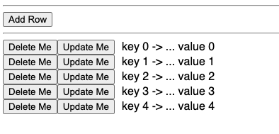
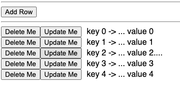
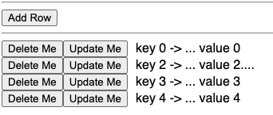
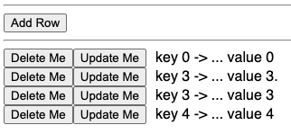

<picture>
    
</picture>

# Notes/Questions on `<For...>` Component

## Requirements

I have a straightforward use-case: _Display items from a collection, allowing
the addition, deletion and edit of the entries._ In doing this the following are
also desired:

- Keep a single vector of elements, in this case `rows: Vec<Row>`, and once the
  approach is ironed out a future version will make the component generic over
  `Row`.
- Make all edits to the vector _in-place_.
- Support signalling updates to parent component. This may be via leptos signals
  or simple generic function. That is not the focus here, but parent code will
  give the component a `Vec<Row>` and in the future there will be a way to
  signal out via something like `Fn(&Vec<Row>)` or `FnMut(&Vec<Row>)`.
- Support for _adding_ new rows and _deleting_ existing rows.

### Leptos `For` Component

The following is the documentation for `<For...>`.

> Iterates over children and displays them, KeyedData by the `key` function given.
>
> This is much more efficient than naively iterating over nodes with
> `.iter().map(|n| view! { cx,  ... })...`,
> as it avoids re-creating DOM nodes that are not being changed.
>

That sounds like just what I want. Here is some more of the docs:

```rust
# use leptos::*;

#[derive(Copy, Clone, Debug, PartialEq, Eq)]
struct Counter {
  id: usize,
  count: RwSignal<i32>
}

#[component]
fn Counters(cx: Scope) -> impl IntoView {
  let (counters, set_counters) = create_signal::<Vec<Counter>>(cx, vec![]);

  view! {
    cx,
    <div>
      <For
        // a function that returns the items we're iterating over; a signal is fine
        each=move || counters.get()
        // a unique key for each item
        key=|counter| counter.id
        // renders each item to a view
        view=move |cx, counter: Counter| {
          view! {
            cx,
            <button>"Value: " {move || counter.count.get()}</button>
          }
        }
      />
    </div>
  }
```

### Our Simple Setup

To mimic what I will need to do in a slimmed down example, here is the setup:

```rust

/// Models a piece of data keyed (uniquely identified) by some `key` function
pub trait KeyedData {
    fn key(&self) -> Cow<'_, String>;
    fn data(&self, cx: Scope) -> View;
}

const BIG_DATA_SIZE: usize = 8*1024;

/// Models a row of data which includes a key and the data portion
#[derive(Debug)]
pub struct Row {
    /// The unique identifier for the data
    key: String,
    /// The value associated with the row
    pub value: String,
    // Just to feel the impact of large rows and the effect of cloning, additional data
    big_data: [u32; BIG_DATA_SIZE],
}

impl KeyedData for Row {

    /// Return the unique identifier
    fn key(&self) -> Cow<'_, String> {
        Cow::Borrowed(&self.key)
    }

    /// Creates a view of the data for a row
    fn data(&self, cx: Scope) -> View {
        view! { cx,
            <span>
                {
                    let mut text = self.key.clone();
                    text.push_str(" -> ... ");
                    text.push_str(&self.value);
                    text
                }
            </span>
        }
        .into_view(cx)
    }
}

////////////////////////////////////////////////////////////////////////////////////
// --- functions ---
////////////////////////////////////////////////////////////////////////////////////
/// Example component used to figure out how the <For...> component works
///
///   * **cx** - Context
///   * **rows** - The collection of data
///   * _return_ - View for for_test_component
#[component]
pub fn ForTestComponent(
    /// Context
    cx: Scope,
    /// The collection of data
    rows: Vec<Row>,
) -> impl IntoView {

    let mut rows = rows;
    ...
}
```

We have our example data: `Row` and for that row we implement `KeyedData` which
can be used by our component to get both the key and the view for the row's
data.

In the documentation for `<For...>` the first thing to notice is the `each`
property in the example is assigned from a signal using `.get()`. With this
approach that `.get()` clones the vector of data. The issue with that is not so
much the cost of cloning - but that could be something to think about. What if
the content in the rows are gigantic in terms of memory footprint but what is
being displayed is only a small subset of the row? Ignoring the performance, the
more salient issue for our requirements is there is a new copy of the user data
that will be held onto by the framework. Where does that data go? Or more to the
point, how can we correlate updates that we want to make in our `Vec<Row>` data?
Each element iterated has its opportunity to create its own `View`:

```rust
    view=move |cx, counter: Counter| {
        view! {
        cx,
        <button>"Value: " {move || counter.count.get()}</button>
        }
    }
```

That view can be reactive and therefore be updated directly when any tracked
signal like `counter` is updated. I think this can be done without any
modification of the DOM elements except the one being updated. Suppose we try to
mimic this: 

```rust
    let rows = create_rw_signal(cx, rows);
    view!{
        cx,
        <div>
        <For
            each=move || rows.get()
            // a unique key for each item
            key=|row| row.key.clone()
            // renders each item to a view
            view=move |cx, row: Row| {

                let mut editable_row = row;
                // Get all the reactive bits of `Row` to allow edit
                let field_1 = create_rw_signal(cx, row...);
                let field_2 = create_rw_signal(cx, row...);
                let field_3 = create_rw_signal(cx, row...);

                // field 1 updated
                create_effect(cx, move || {
                    editable_row.field_1 = field_1.get()...
                    // update in our vec
                    // ??? - but how to get to it
                })

                // field 2 updated
                create_effect(cx, ...)

                ...

                view! {
                    cx,
                    <input value={field1...} />
                    <input value={field2...} />
                    <input value={field3...} />
                }
            }
        />
        </div>
    }
```

Now the list of elements is shown and each element can be edited. For any
element's `view`, even if it is catching all the events and capable of updating
its local mutable `edit_row` - how can it update our vector and then signal the
parent that the vector is new/updated? The goal is to allow edit of individual
rows **and** signal the parent of the updated vector _by reference_ (i.e.
`Fn(&Vec<T>)`). So we need a way to get the updated `Row` that has just been
edited from the results of edits in the `view=move |cx, row: Row|` closure back
to our owned `Vec<T>`. The problem is we have a new updated `row: Row` but where
do we put it into our `Vec<T>`? We need an index to know where it goes and we
are not given any indices by the component when it calls back to us to create
the `row` view. It might be nice if _leptos_ provided (`view=move |cx, i: usize,
row: Row| ...`) but that may not work well in the face of additions/deletions.

We can overcome this by changing what we feed to `each`. Rather than feed it a
copy of the rows, which it then turns into an iterator over those rows, we could
feed it an enumerated iteration over the rows. The `enumerate` function
transforms an iterator of T into an iterator of the `(current iteration count,
T)`.

This approach looks something like:

```rust
<For
    each=move || { rows.get().into_iter().enumerate() }
    key=move |(_, row)| { row.key().into_owned() }
    // renders each item to a view
    view=move |cx, (i: usize, row: Row)| {

        let mut editable_row = row;
        // Get all the reactive bits of `Row` to allow edit
        let field_1 = create_rw_signal(cx, row...);
        let field_2 = create_rw_signal(cx, row...);
        let field_3 = create_rw_signal(cx, row...);

        // field 1 updated
        create_effect(cx, move || {
            editable_row.field_1 = field_1.get()...
            // update in our vec
            rows.update(|rows| {
                let this_row = rows.get_mut(i).unwrap();
                *this_row = row
            )
        })

        // field 2 updated
        create_effect(cx, ...)

        ...

        ...
        view! {
            cx,
            <input value={field1...} />
            <input value={field2...} />
            <input value={field3...} />
        }
    }
```

### Crude Sketch Of Component

First, lets set up a crude display of what we are after:



With this the user can add a new row: `Add Row`. Delete a row: `Delete Me`. And
update a row: `Update Me`. To mimic edits the control will just add a `.` to the
`value` portion each time _Update Me_ is pressed. After the third `Update Me`
row is pressed 4 times we have:




### Updating Rows

For this simple example the update will just add a `.` to the value each time
the button is pressed. What this means is that our view created by `view=move
|cx, (i, row)|` **_needs to react_** to the button press event. We already have
capability for the entire `<For...` view to _react_ to changes in our vector:

```rust
    let rows = create_rw_signal(cx, rows);
    <For
        each=move || { rows.get().into_iter().enumerate() }
        key=move |(_, row)| { row.key().into_owned() }
        ...
    />
```

The call to `create_rw_signal` establishes reactivity capabilities for `rows`.
Whenever the `rows`, held by the leptos framework, is updated by a call such as
`rows.update(|rows| /* do update to rows */)`, the framework tracks that and it
reruns any closures that have accessed `rows` like the `each=move || {
rows.get().into_iter().enumerate() }` does. So when we add support to add rows
we are in good shape for the added rows to be displayed because the `each`,
`key`, and `view` related props will rerun their closures _reactively_.

But we also want to have the display for the row updated when the user clicks
`Update Me`. So we need another _reactive_ element that each row `view` can be
triggered by.

Something like this should do the trick:

```rust
    let signals = store_value(
        cx,
        rows.iter()
            .enumerate()
            .map(|(i, _)| create_rw_signal(cx, i))
            .collect::<Vec<_>>(),
    );
```

What this is doing is establishing a vector of signals - one per row displayed
in the for each. 

> **Note** The `signals` is a vector kept in leptos via `store_value` which is
> **not** _reactive_. Just sticking your stuff needed by the component under
> development inside leptos is a good idea because when the `cx` goes away so
> does this data. Also, as a practical matter, using `create_rw_signal`,
> `create_signal` for reactive data and `store_value` for non-reactive data
> makes working with this data in closures you write to react to events super
> easy. The reason is all these functions effectively return _handles_ or _ids_
> which are _Copy_. This means no more fighting the borrow checker when using
> this data.

Consider this update logic associated with `Update Me` button:

```rust
<button on:click=move |_| {
    rows.update_untracked(|rows| {
        if let Some(row) = rows.get_mut(i) {
            row.value.push_str(".");
        }
    });
    let signal = signals.with_value(|signals| signals.get(i).unwrap().clone());
    signal.update(|i| *i = *i);
}>"Update Me"</button>
// The display portion
<span style="padding-left: 10px;">
    {move || {
        let signal = signals.with_value(|signals| signals.get(i).unwrap().clone());
        signal.track();
        rows.with_untracked(|rows| rows.get(i).unwrap().data(cx))
    }}
</span>
```

When updating a row we need to get into our vector of data and make the update.
We reach into leptos to get a mutable reference to our data via
`rows.update_untracked(|rows|...)`. Again, because leptos is watching all our
interaction with the data it owns, we need to decide each time we access our
data if we want that access to signal any closures referencing our data to be
re-invoked. The `<For...>` component does lots of work to efficiently deal with
our data. It uses the `key=...` property to uniquely identify our rows and when
rows are added or deleted it can avoid recreating the complete set of rows in
the DOM. So we want to take advantage of that by only signalling changes to the
`rows` that involve cardinality changes to the vector (i.e. additions and
deletions). In this case we are simply updating a row, so we don't want the
entire collection of elements to be redisplayed just because we change one
entry. Hence, we reach into the leptos reactive bag of data with
`rows.update_untracked` and then we update **our** copy of the data. But just
updating the data in our vector is not enough. We need our view/display to
_react_ to those changes. To trigger that reactivity we need to broadcast/signal
the update to the corresponding view:

```rust
let signal = signals.with_value(|signals| signals.get(i).unwrap().clone());
log!("Signaling {i}");
signal.update(|i| *i = *i);
```

Grab the signal and then by invoking update, any listeners on that signal will
get rerun. Since the display portion is tracking the signal for its specific row,
when that row is updated the display rerun with the new data.

### Dealing With Indexing

There is a new problem, though. The requirements include support for _adding_
and _deleting_ rows and this indexing via `enumerate` approach may need extra
thought. 

```rust
view! { cx,
    <button on:click=move |_| {
        log!("Adding Row");
        // Do add here
    }>"Add Row"</button>
    <hr/>
    <For
        each=move || { rows.get().into_iter().enumerate() }
        key=move |(_, row)| { row.key().into_owned() }
        view=move |cx, (i, row)| {
            view! { cx,
                <div>
                    <button on:click=move |_| {
                        log!("Delete clicked on {row:?}");
                        rows.update(|rows| {
                            rows.remove(i);
                        });
                    }>"Delete Me"</button>
                    <button on:click=move |_| {
                        log!("Updating {i}");
                        rows.update_untracked(|rows| {
                            if let Some(row) = rows.get_mut(i) {
                                log!("Component cloning {i}");
                                row.value.push_str(".");
                            }
                        });
                        let signal = signals.with_value(|signals| signals.get(i).unwrap().clone());
                        log!("Signaling {i}");
                        signal.update(|i| *i = *i);
                    }>"Update Me"</button>
                    <span style="padding-left: 10px;">
                        {move || {
                            //log!("(Re)display {i}");
                            let signal = signals.with_value(|signals| signals.get(i).unwrap().clone());
                            signal.track();
                            rows.with_untracked(|rows| rows.get(i).unwrap().data(cx))
                        }}
                    </span>
                </div>
            }
                .into_view(cx)
        }
    />
}
```

Here we've implemented the delete logic for when `Delete Me` is clicked:

```rust
    <button on:click=move |_| {
        log!("Delete clicked on {row:?}");
        rows.update(|rows| {
            rows.remove(i);
        });
    }>"Delete Me"</button>
```

That is simple enough and at first glance it works. Assuming the state we were at before:

- Refreshed view of data
- Clicked `Update Me` four times on the third row

We then _delete_ the second row and see this:



This looks like what we want but there is a serious problem. When deleting the
second row (i.e. `key 1`) all subsequent rows shifted down as expected. But the
problem is our row views are holding on to indices that are now invalid. The
view of the second row is holding on the index `2` which points to the third
row. If we click `Update Me` on the second row showing `key 2 -> ...` this is
what we see next:



What has happened is pressing `Update Me` on the second row displaying `key 2 ->
...` reached into our vector at index 2 which is now pointing at the data `key 3
-> ...` and updates it. The view for the second row is updated but the source
for the update was incorrect. So we are off the rails and this approach is not
going to work as is.

### Salvaging Indexing

It appears relying on vector indexing to get at our data is problematic in the
face of deletions. Also, the leptos `<For...>` has invested in the concept of a
`key` to uniquely identify the rows - so maybe we should be focusing on that
for indexing our rows instead.

Our new approach will be to have a map of signals indexed by key:

```rust
let signals = rows
    .iter()
    .enumerate()
    .map(|(i, row)| (row.key().into_owned(), create_rw_signal(cx, i)))
    .collect::<HashMap<String, RwSignal<usize>>>();

let entries = create_rw_signal(cx, rows);

let signals = store_value(cx, signals);
```

Here we iterate over the rows passed into us, _before putting them in leptos
store_ and for each we get its key and create a new signal for that row. Now in
any context where we have a key we can find the signal associated with that
view.

Also, since we know there is cloning going on that can be avoided, we'll use a
new approach to iteration that avoids the clones of our `Row` data.

First some helper functions:

```rust

// Reactive number of elements
let num_elements = move || entries.with(|entries| entries.borrow().len());

// Get the nth key by accessing the vector in a non-reactive way to get the element
// and then get a copy of the key
let nth_key = move |n: usize| {
    entries.with_untracked(|entries| entries.borrow().get(n).map(|entry| entry.key.clone()))
};

// Reactively grab the signal associated with a key. Note the convenient clone of
// the signal which is just a few id's used to lookup the actual data in leptos
let key_signal =
    move |key: &String| signals.with_value(|signals| signals.get(key).unwrap().clone());

```

#### Iteration Strategy

The new iteration strategy is to use a `Range<usize>` as the argument for
`each`. This means leptos can iterate without a vector. It also means that what
it gives us are indices instead of our `Row` items. We can use an index to get
to our `Row` in the vector and from that we can get to our key. The keys are
stable, but the indices are giving us problems in the face of deletion. To
overcome this, when each view is created we use the index to get the key, which
is stable. We then tie our reactivity not to the `i` passed into us which may
change in the face of deletions. Rather we grab the index from the `HashMap`
using the key. For this to work special logic when deleting a row is required to
adjust all indices of items after the row being deleted.

```rust
// Delete a row by key. In addition to deleting the row it patches the index of all
// rows after the row identified by key. Since those rows will shift down to accommodate
// the removal, their indices must be updated.
let delete_by_key = move |key: &String| {
    if let Some(position) =
        signals.with_value(|signals| signals.get(key).cloned().map(|signal| signal.get()))
    {
        entries.update(|entries| {
            signals.update_value(|signals| {
                entries.remove(position);
                let len = entries.len();
                let elements_after = &entries[position..len];
                for (i, element) in elements_after.iter().enumerate() {
                    if let Some(entry) = signals.get_mut(&element.key) {
                        entry.update_untracked(|e| *e = position + i);
                    }
                }
            });
        });
    }
};
```

Now we have all the pieces to create the following view.

```rust
<For
    each=move || 0..num_elements()
    key=move |&i| nth_key(i)
    view=move |cx, i| {
        let key = Rc::new(nth_key(i).unwrap());
        let key_for_update = Rc::clone(&key);
        let key_for_delete = Rc::clone(&key);
        let key_for_display = Rc::clone(&key);
        view! { cx,
            <div>
                <button on:click=move |_| {
                    delete_by_key(&key_for_delete);
                }>"Delete Me"</button>
```

The delete button deletes the row and adjusts all the indices in the map
positioned after the item deleted.

```rust

                <button on:click=move |_| {
                    let key_signal = key_signal(&key_for_update);
                    let reactive_i = key_signal.get();
                    entries
                        .update_untracked(|entries| {
                            if let Some(entry) = entries.get_mut(reactive_i) {
                                entry.value.push_str(".");
                            }
                        });
                    key_signal.update(|_| {});
                }>"Update Me"</button>
```

The update gets the *current* index for the key, grabs the row and adds a `.` to
signify the update. It then calls `key_signal.update` to trigger a redisplay of
the actual contents shown here:

```rust

                <span style="padding-left: 10px;">
                    {move || {
                        key_signal(&key_for_display)
                            .with(|&i| {
                                entries
                                    .with_untracked(|entries| {
                                        if let Some(row) = entries.get(i) {
                                            row.data(cx)
                                        } else {
                                            view! { cx, <h4>"Error"</h4> }
                                                .into_view(cx)
                                        }
                                    })
                            })
                    }}
                </span>
            </div>
        }
            .into_view(cx)
    }
/>
```

The final part of the row that shows the detail is reactive to changes in its
content due to `key_signal(&key_for_display).with(...)`.

> *Note* When updating the detail view it grabs the data without tracking
> `entries` which is really a signal for the cardinality of the rows.


